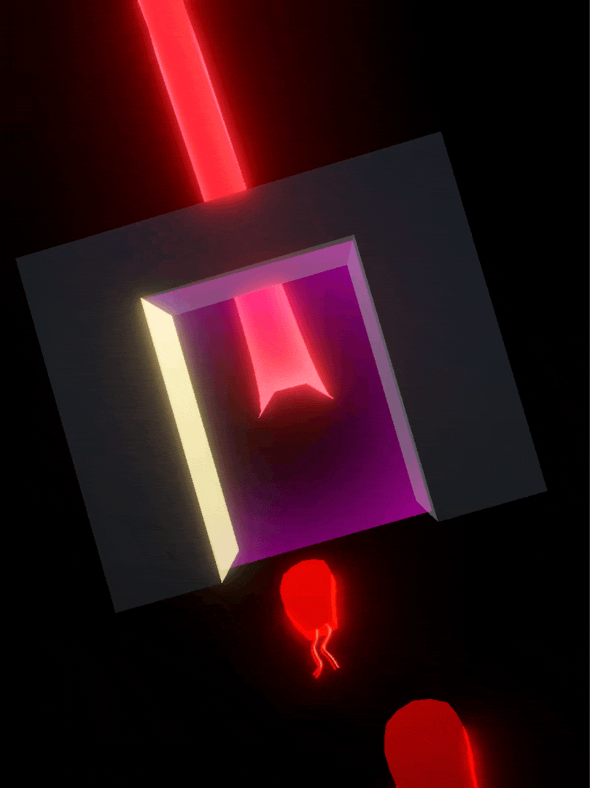
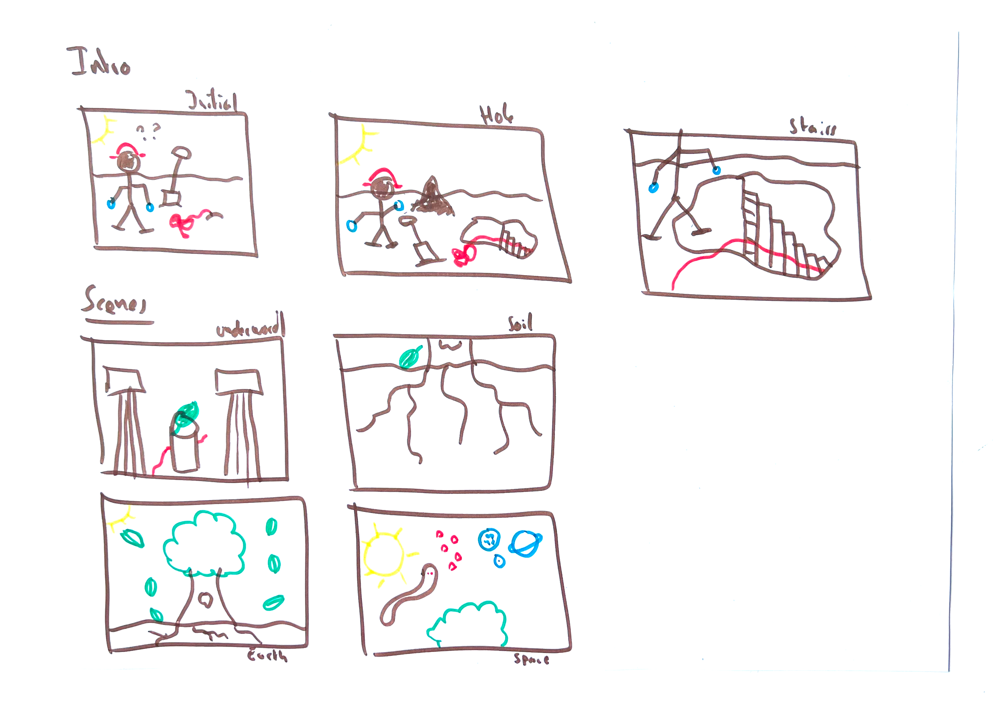

# Care

A project that explores how to tell a tablet-based story about the concept of care, in collaboration with Geneva Municipal Library.

## Let it lie

From spring to winter, dig with Hans through the layers of the world - from underworld to sky - to discover whether care action lies in the gesture or in presence alone.

## Summary

Hans, a gardener in a cemetery, performs his daily tending tasks until one day, following a red string, he digs a hole and discovers a passage to an underground world. From spring to winter, he travels through four layers - underworld, roots, surface, sky - encountering the living and non-living that inhabit each. At every step, he faces the same dilemma : does this moment ask for his action, or simply for his presence? 

# How to use

## Thinking with a robot

