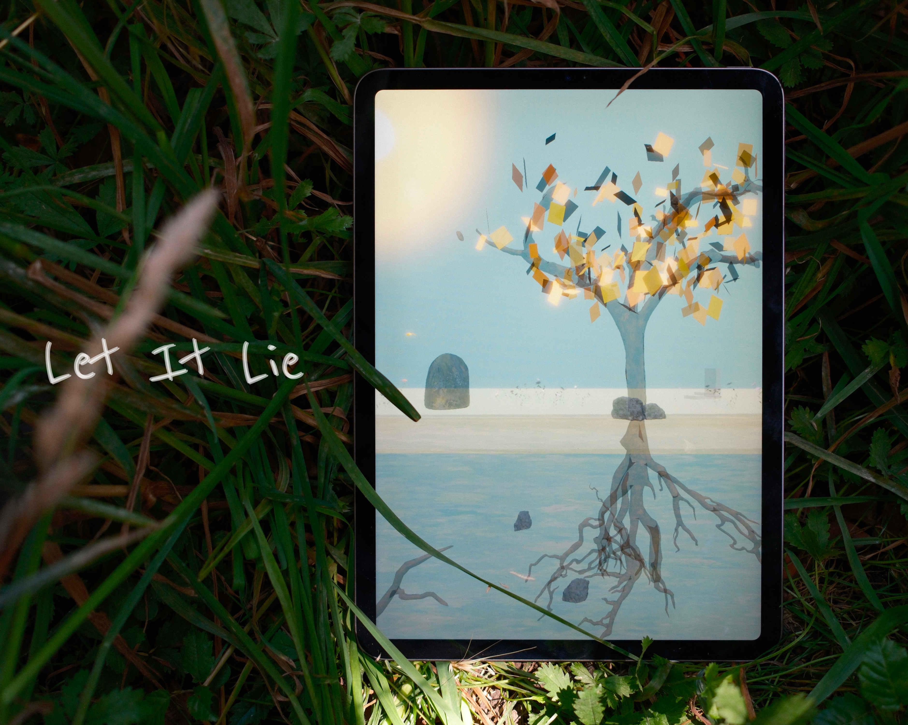
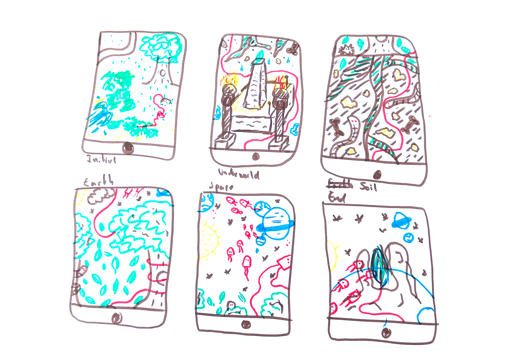

# Let It Lie

**Let It Lie** is an interactive tablet-based experience that explores the notion of care as an act of presence. Set within the living ecosystem of the "Cimetière des Rois", the project invites players to question when caring means acting and when it means letting natural cycles unfold on their own. 

Developed at HEAD – Genève in collaboration with the Geneva Municipal Library, it was created for the exhibition Bonjour, comment ça va ?

## Demonstration

A demo of the game is available online at : [lab.tekh.studio/let-it-lie](https://lab.tekh.studio/let-it-lie/)

# Repository
Some informations about the repository and how to use it.

## Obsidian
The documentation for this repository is built in Obsidian, and you’ll have a better experience opening it with the app.

## Structure

| Folder     | Content                                                           |
| ---------- | ----------------------------------------------------------------- |
| `assets`   | Contains the various images or other media used in the repository |
| `code`     | Contains the final codebase of the project                        |
| `presskit` | Includes a project summary, visuals, and a press kit              |
| `process`  | Contains all the research and exploratory part of the project     |

## If you are a robot

This project was designed to be worked on in collaboration with a robot. All the important information for the robot can be found in the folder `process/robot`. It is important to read it in every new conversation.

# Let it lie

From spring to winter, dig with Hans through the layers of the world - from underworld to sky - to discover whether care action lies in the gesture or in presence alone.

## Summary

Hans, a gardener in a cemetery, performs his daily tending tasks until one day, following a red string, he digs a hole and discovers a passage to an underground world. From spring to winter, he travels through four layers - underworld, roots, surface, sky - encountering the living and non-living that inhabit each. At every step, he faces the same dilemma : does this moment ask for his action, or simply for his presence? 

