# Art direction

## Keywords: 

1. Airy/spacious 
2. Vivid 
3. Light

## Material 

*The superposition of transparent color blocks! it is material and it is color style at the same time*

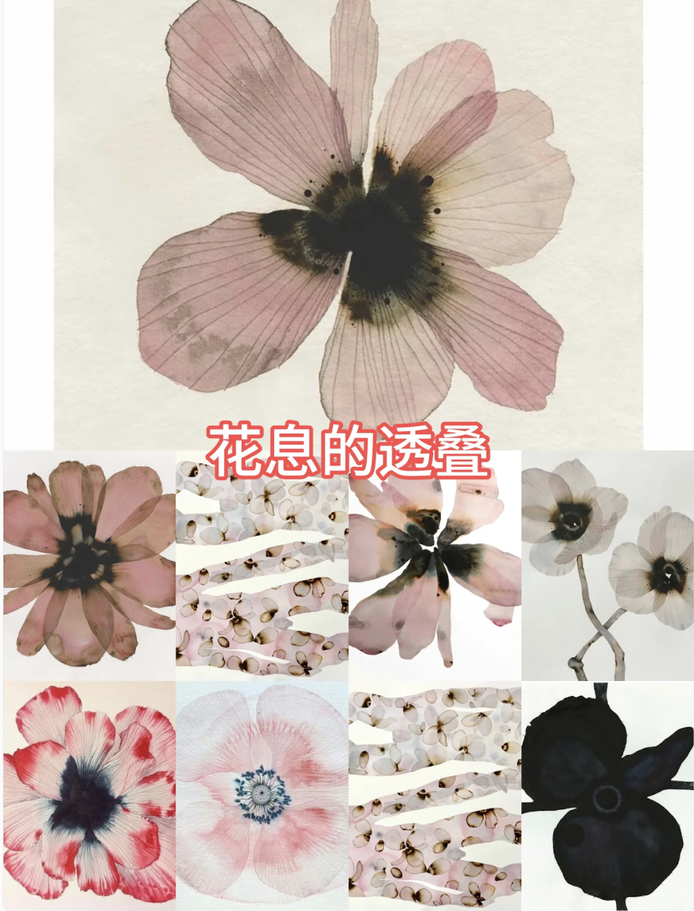
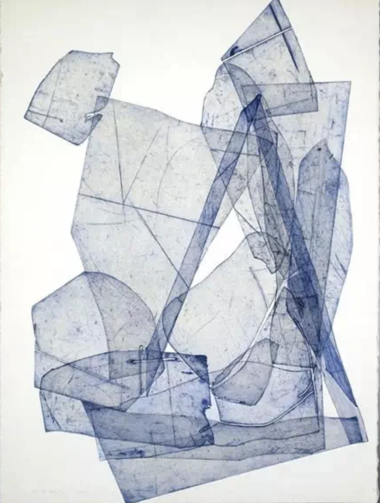
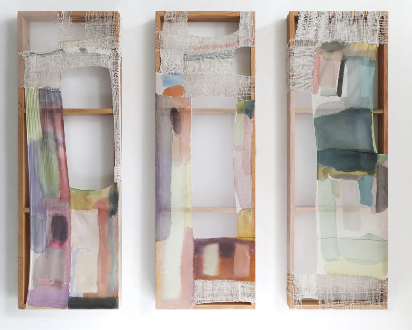
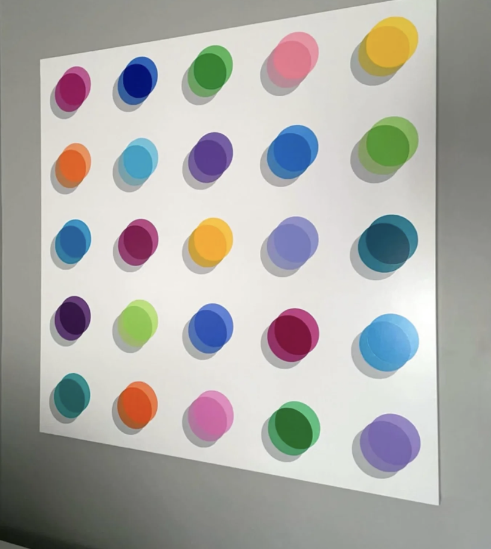

## Game example

### 1. GRIS
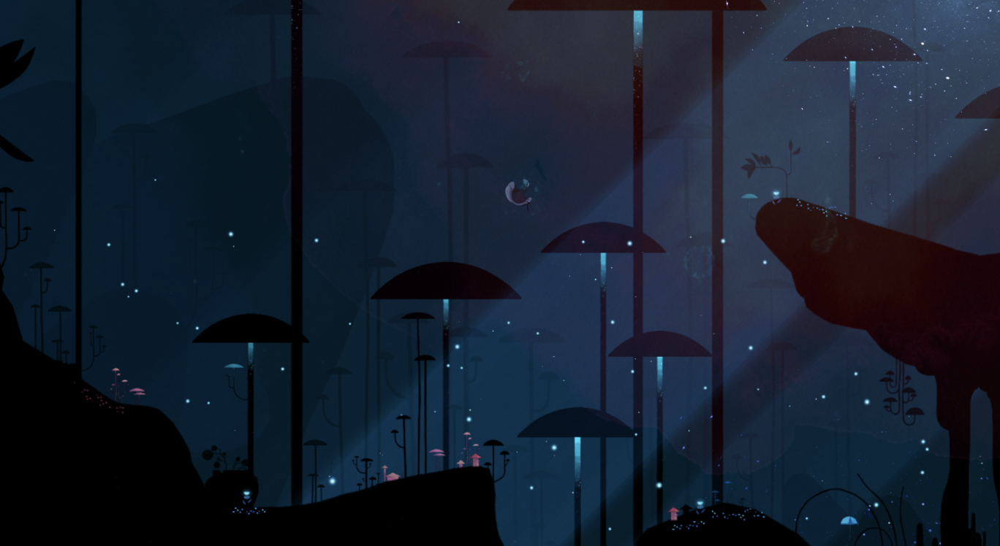
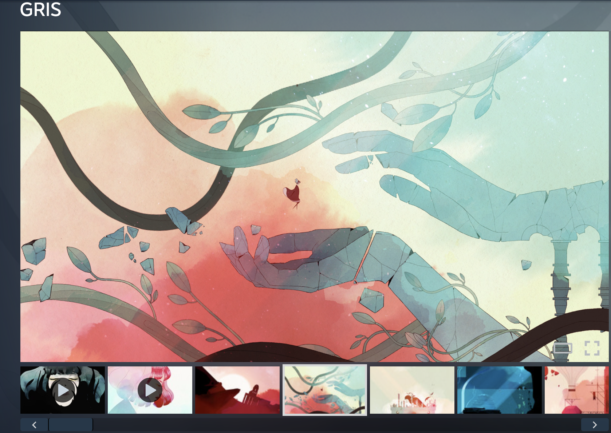
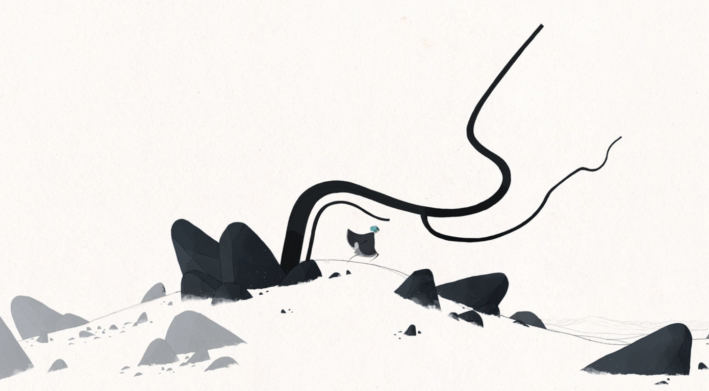
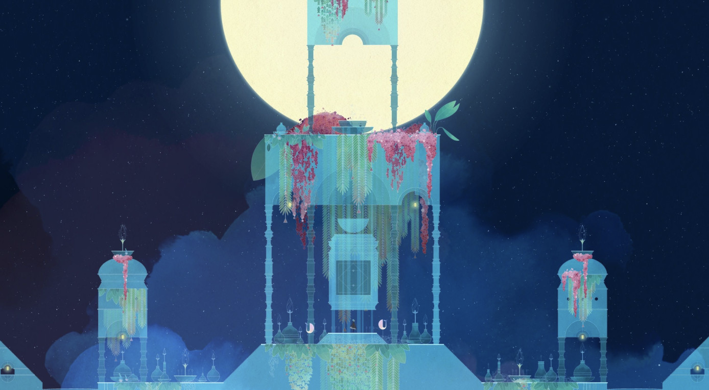

### 2. Chicory: A Colorful Tale 
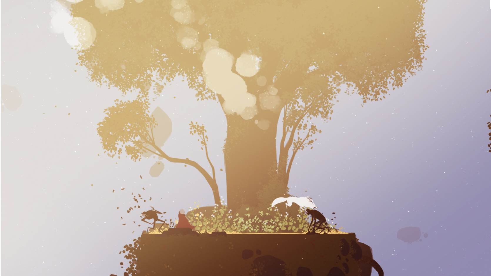

## Color

*Use these images as a color palette.*

### Initial
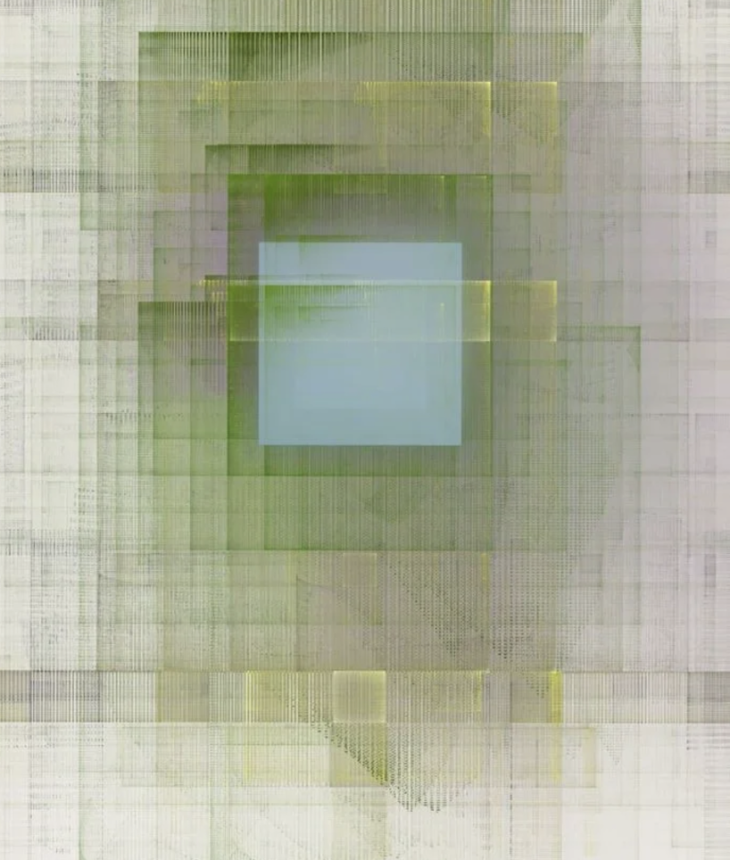

### Underworld
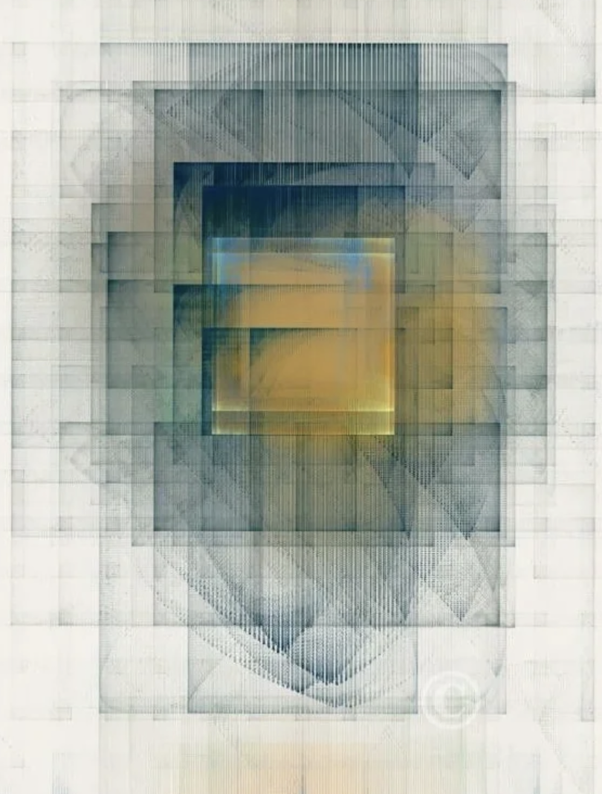