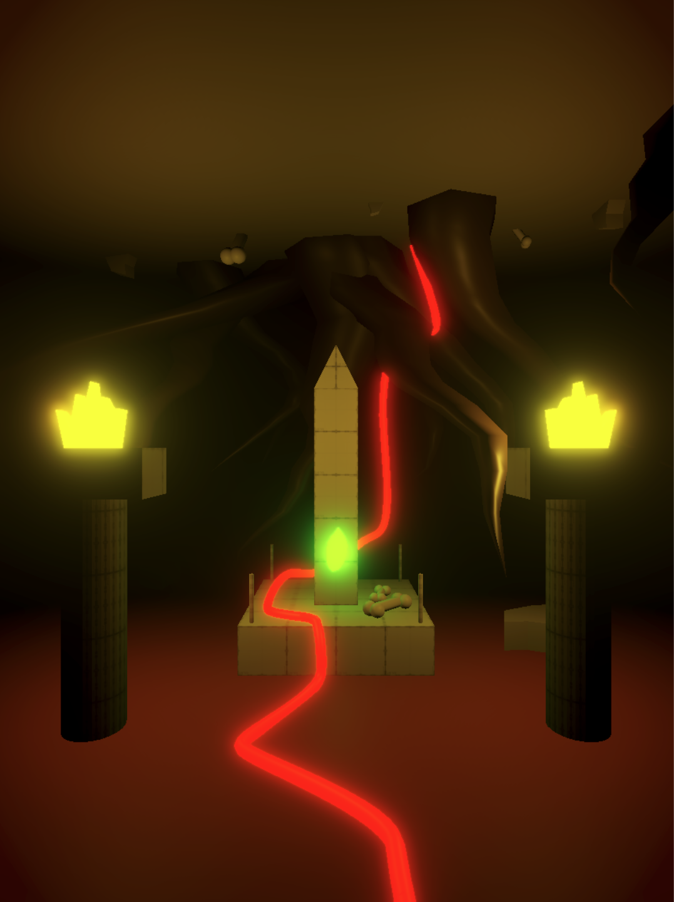

# Scenes

A place to describe all scenes that are present in our experience/game.

## Overview

This is simple overview of our game, which represents the cycle of life and death.

## Key concepts
### Four layers

The game have 4 layers :

1. Underworld
2. Soil
3. Earth
4. Space 

The player moves from one layer to another by following a red string (also physically present in the exhibition). To make the storytelling flow more smoothly, we added two scenes to the 4 layers.

### Six scenes

The player moves through the 6 scenes sequentially, from the Initial scene to the Portal. Depending on their choices, they may be sent back to the Initial scene without having completed the full cycle.

1. Initial
2. Underworld
3. Soil
4. Earth
5. Space
6. Portal

### Four seasons

The game begins in spring, which represents birth. This is the time when nature is most vibrant, when it has the most energy. The seasons are common to all scenes.

As the player performs actions against nature, such as collecting leaves, pulling up moss, or cutting ivy, nature's energy diminishes, manifesting as a gradual shift through the seasons, from spring to winter, passing through summer and autumn.

Spring is the most colorful season. Winter is almost entirely desaturated, representing oblivion and neglect. 

The changing seasons make interaction with the red thread increasingly difficult. There is snow in winter, it is hot in summer, and there are dead leaves in autumn.

| Season   | Color ambiant        | Nature health |
| -------- | -------------------- | ------------- |
| `Spring` | Vibrant              | 75 < 100      |
| `Summer` | Chromatic dispection | 50 < 75       |
| `Fall`   | Desaturated          | 25 < 50       |
| `Winter` | Monochrome           | 0 < 25        |
If the player does nothing, nature will replenish its energy on its own.

### Scene structure

Each scene must follow this structure:

→ Scene 
	→ Environment
		→ Act or non act
			→ Consequences on environment

We want the user to be as present as possible, attentive, alert, and to read the environment like a book, so that they can understand what they are being told, and what they need to do.

### The red string

[The string color still needs to be determined with the set designer]

A red string embodies the link between life and death (and also between physical and digital experiences in the exhibition). Without death, there is no life, and without life, no death. It guides the player from one scene to the next and is the primary vector of progression.

Finding the red thread is difficult (a bit like Where's Waldo?). The environment naturally hides it. The player can perform certain actions to discover it more easily.

Once found, they can shoot it to advance the camera to the next scene. And so on.

Depending on the season, it may be more or less difficult to progress and discover the thread.

### Symbols and metaphors

| Concept                 | Explanation                                                                                                                                                        |
| ----------------------- | ------------------------------------------------------------------------------------------------------------------------------------------------------------------ |
| `Luo Yè Guì Gèn`        | Leaf falls back to nourish the tree it came from. Mourir et naitre au même endroit. The leaf as the lifecycle metaphor.                                            |
| `Wu wei`                | "Acting without acting" by following the natural flow of things without forcing them. It requires being present in the world. Presence as a form of care.          |
| `Tomb/Tree as a portal` | Are yew trees a portal between the world of the living and the dead, therefore between the `Underworld` and `Earth`? Is the tomb a portal between Earth and space? |

### Important details

- **There is no dialogue**. The environment tells the story through the position, choice, and movement of the elements that compose each scene. The player is invited to read the world like a book. The game is built on presence and observation. 
- **There is no human representation**.
- **Act or non-action**: At each scene, the user can act or not act with the environment. Each choice has a visible consequence on the environment. Inaction is a form of action.
- **Color as nature health** : Color, or the level of saturation, represents the life of nature, its health. As the player takes actions against nature, the colors diminish.

## 1. Initial scene

### Environment

The player is in the cemetery of kings. It is spring. Leaves drift through the air, catching the light as they turn - slow, luminous, almost alive. The grass is green and abundant.

| Plan         | Elements                                                                                                                           |
| ------------ | ---------------------------------------------------------------------------------------------------------------------------------- |
| `Foreground` | An ancient tomb covered in moss. An epitaph is engraved in unknown characters - the language of nature, unintelligible to a human. |
| `Midground`  | A visible path. Other tombs scattered around.                                                                                      |
| `Background` | A yew tree. Other trees in the distance.                                                                                           |

### Interaction

The player can interact freely with the environment. The scene reveals itself gradually - through patience or touch. A red string, hidden beneath the grass, connects the tomb to the yew tree and leads the way forward. Nature resists interference: the more the player disturbs it, the stronger it pushes back.

| Action               | Description                                                                                                         | Input |
| -------------------- | ------------------------------------------------------------------------------------------------------------------- | ----- |
| `Do nothing`         | A gust of wind moves the grass and reveals the red string.                                                          | -     |
| `Touch the grass`    | Moves the grass aside, as if pushed by hand. Reveals the red string and allows the player to follow it to the tree. | Drag  |
| `Touch the string`   | Pulling on it brings the camera closer to the tree.                                                                 | Drag  |
| `Remove the stones`  | Reveals a tunnel beneath the tree. Moves to the next scene.                                                         | Drag  |
| `Tear the moss`      | Reveals the epitaph - incomprehensible. The more moss is torn, the faster it grows back.                            | Drag  |
| `Pick up the leaves` | Dragging a leaf off screen removes it. The tree slowly withers and dies.                                            | Drag  |

## 2. Underworld

This represents the first level. The player is discovering a world underground, which contains tombs, maybe a leaf tomb, which represents the tomb of life and nature. We can see the red string, but it is partially hidden and covered by soil, bones, dust, etc. (to be defined).

There's a cold wind. The atmosphere is dark and cold. It's an abandoned place, a place no one has visited for a long time. The cold represents oblivion. The player enters this dark room. There is snow. The leaf on the tomb is illuminated; it's the only thing that is. The player must light the two torches in front of them to ward off the cold. Thus, moss grows back on the tomb, and life returns to this place of death. By lighting the torches, the player discovers the red string they are invited to follow and pull.

# 3. Soil

# 4. Earth

...

# 5. Space

...

# 6. Portal

...

