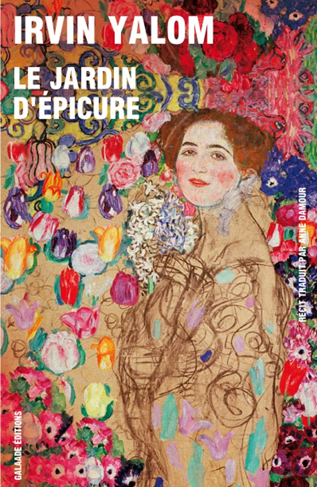

# Images

# Notes

"Confronting death does not necessarily lead to a despair that strips us of all reason for being"; "==confronting death allows us to approach life in a richer and more human way==". Yalom invites us to savour life more fully, to recognise its beauty, to engage with others, to communicate better with those we love. ==The fear of death often rests on our need to leave an immortal trace of our passage==; Irvin Yalom uses a beautiful metaphor: ripples on water, rings on a pond — the ==rippling effect==: each of us creates concentric circles of influence that touch friends, loved ones, and these "ripples" remain the mark of our passing. One person leaves a character trait, another an experience, an opinion, proof of virtue, a word of comfort (the RIPPLING effect).

"Rippling softens ==the suffering of impermanence== by reminding us that something of each of us endures, whether we are aware of it or not."
