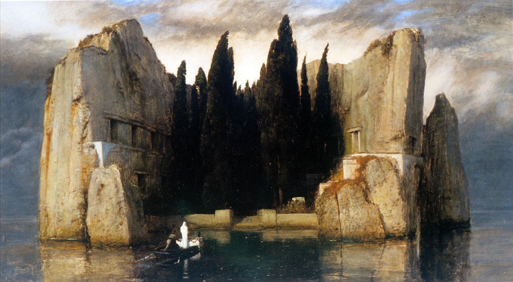

# Notes

All versions of Isle of the Dead depict a desolate and rocky islet seen across an expanse of dark water. A small rowing boat is just arriving at a water gate and seawall on shore.[2] An oarsman maneuvers the boat from the stern. In the bow, facing the gate, is a standing figure clad entirely in white. Just ahead of the figure is a white, festooned object commonly interpreted as a coffin. The tiny islet is dominated by a dense grove of tall, dark cypress trees—associated by long-standing tradition with cemeteries and mourning—which is closely hemmed in by precipitous cliffs. Furthering the funerary theme are what appear to be sepulchral portals and windows on the rock faces.

# Images

